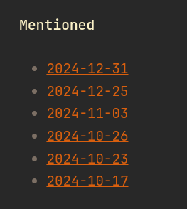

Today marks my 100th day of journaling. It helped me overcome a crisis and enhanced my life in ways I never expected.

## the beginning
But why did I even start journaling? The end of September this year was very hard for me. Many bad things happened that put me into a personal crisis. My mental health suffered immensely, and I needed a way of documenting what I've felt (and didn't feel), what I've eaten and what thoughts I had that day. Getting used to journaling wasn't hard, because I needed to journal. I wrote down thoughts that I had, so they couldn't keep me away at night. Without journaling, I would have slept much, much less.  
Once journaling became part of my routine, I started exploring the best format to suit my needs.

## physical, digital, or something in between?
Honestly, I didn’t think about this until weeks later. At first, I just needed a way to write. I didn't have the mental capacity to think of such questions, so I just downloaded the first open source note-taking app that I could find, [Notally](https://play.google.com/store/apps/details?id=com.omgodse.notally). It's a great app for local notes, but wasn't that great for journaling. When I didn't have my phone on me, I couldn't access my journal. I also was afraid of losing my journal, one big note in the app didn't feel that safe to me, so I started looking for alternatives.

### the appeal of a physical journal
The idea of a physical notebook had a romantic appeal. But for someone as forgetful as me, it wasn’t practical. If I ever misplaced it during a mental breakdown, I’d lose my way to cope with it. That's a risk I couldn't take. So, I decided against it.

### finding the right digital solution
But what digital app could be a good replacement? I want to access my journal anytime and everywhere. From my phone, laptop, desktop or even my Steam Deck. Also, I didn't want to fall victim to vendor lock-in. Ideally my notes would be saved in plain text, so I chose my favorite markdown note-taking program [Obsidian](https://obsidian.md/). It's free, though not open-source, but that's okay because my notes are still stored as plain text markdown files. The Daily Notes plugin automatically creates a note for the current day. And I can even link notes, to connect things together. This is great because I witnessed other improvements that journaling gave me.

## why i still journal
The initial crisis I mentioned in the beginning is over. I still sometimes cry, but my last breakdown was some weeks ago and I feel mentally stable. But I experienced other great benefits from journaling that really improved my life. The crisis may be over, but negative thoughts or haunting questions are still occasionally present. Trusting my journal with these things helped me to distance myself from them and get a new perspective on some problems. It also  helped me let go of these things. But the most important benefit I've experienced is, that my memory has improved. If I wrote about a talk I had with a friend, an activity I did or a thought that I had, I could remember that. This is a game changer for me, because I am really, really forgetful.
If we combine this benefit with the ability to link things together, I could, for example, keep track of every meeting (not the business type of meeting) I had with a person, because I can now see on which day I last linked to a person.

This is my graph, every point represents a note. The yellow notes are my daily notes, red notes are people. These notes now interconnect and form a web. This is not only incredibly cool to look at, but also incredibly useful. I can now open a note of a friend of mine and see the last time I mentioned them.
This helps me reach out to friends more regularly, because I can see when I reached out to them the last time.

## conclusion
100 days in, journaling has done more than just help me through tough times. It helped me understand myself better, cope with negative emotions and improved my memory. I'll keep up the habit of journaling for the now-fresh year of 2025